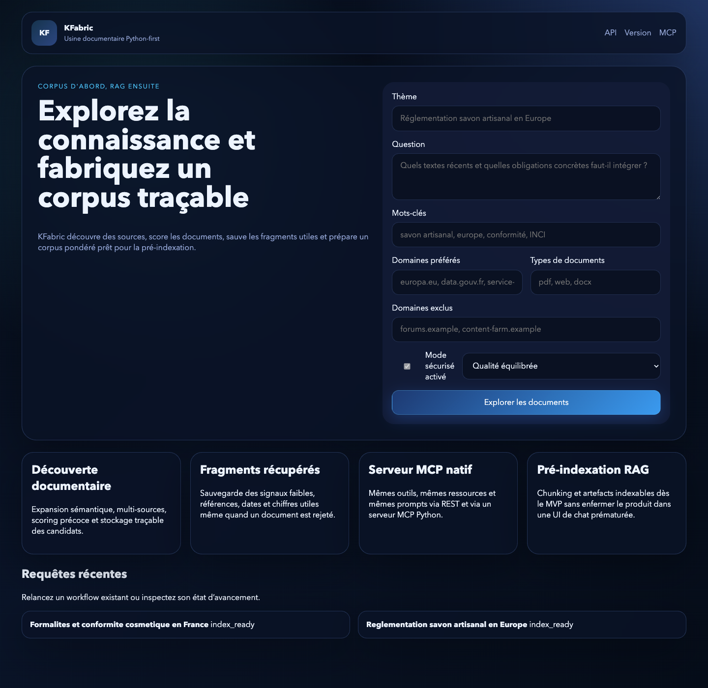
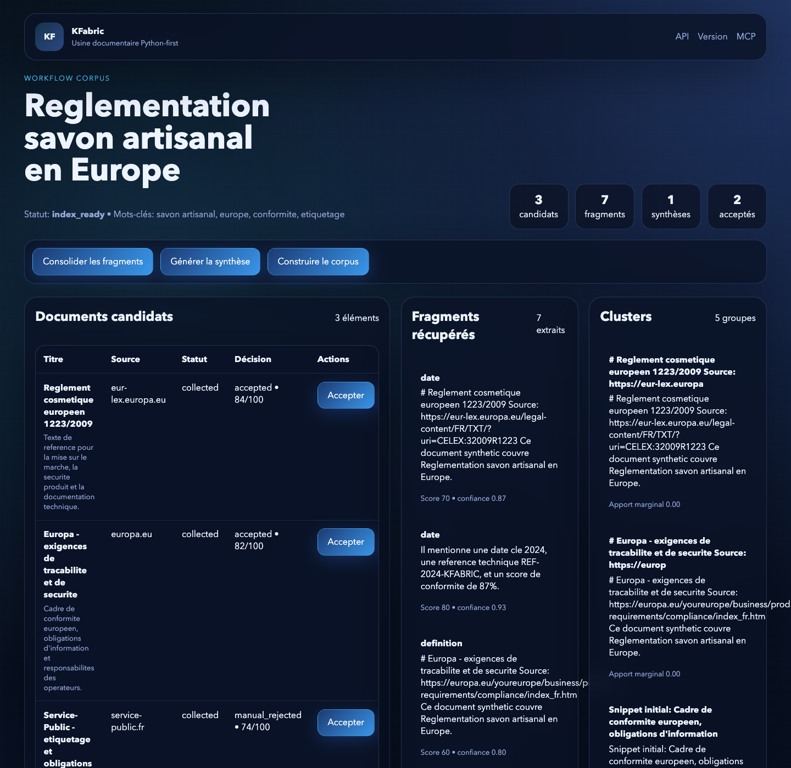
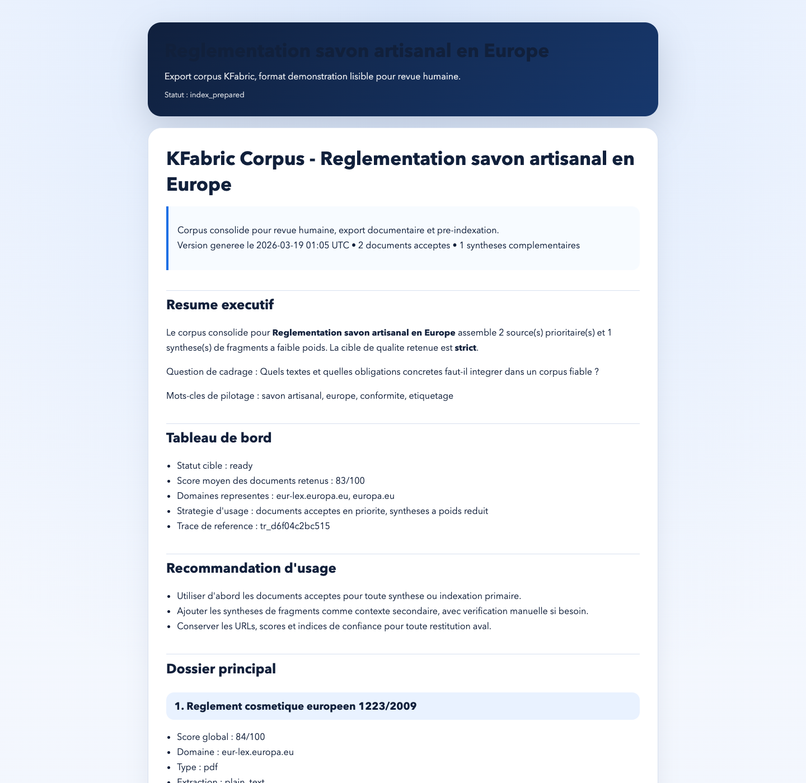
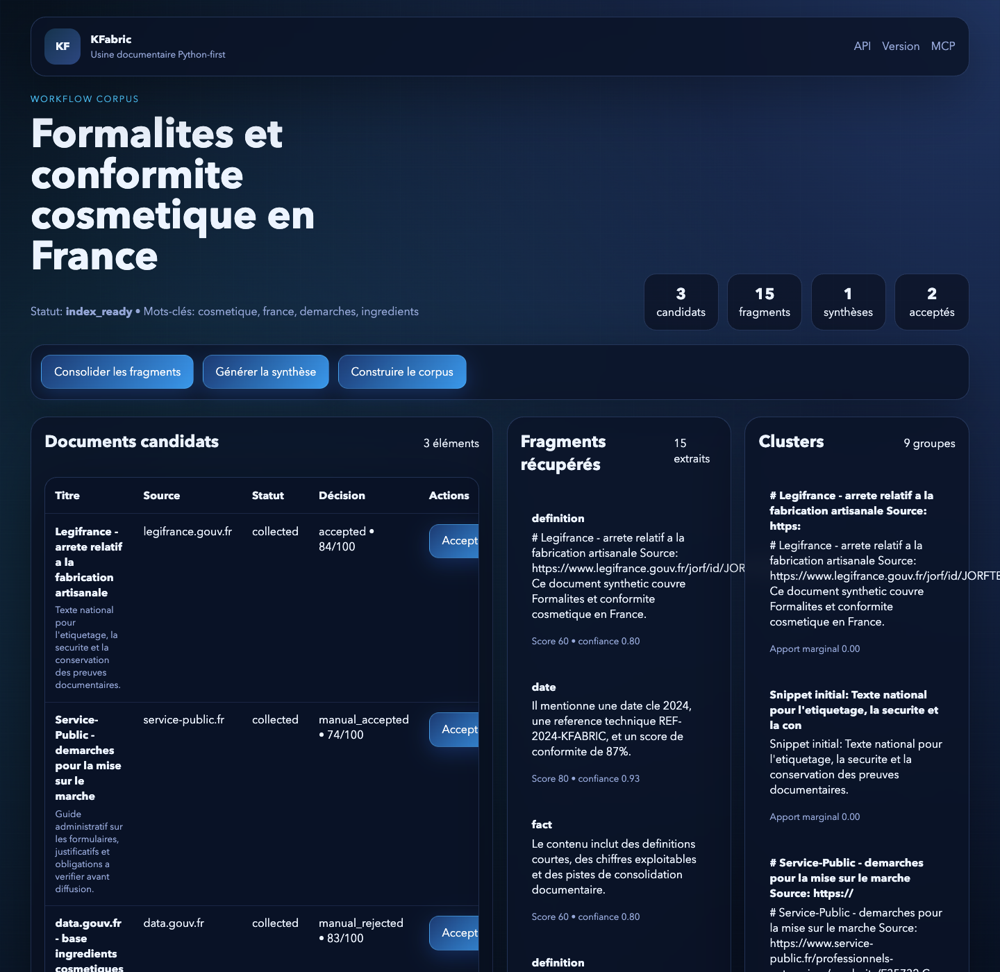

# Démo produit KFabric

Cette démonstration met en avant deux corpus générés par le pipeline KFabric
avec des sources institutionnelles cohérentes et un rendu final exportable.

## Scénarios

### 1. Réglementation savon artisanal en Europe

- focus : textes européens, conformité et traçabilité
- domaines : `eur-lex.europa.eu`, `europa.eu`, `service-public.fr`
- livrable visé : corpus réglementaire court, traçable et prêt pour pré-indexation

### 2. Formalités et conformité cosmétique en France

- focus : démarches administratives, référentiel national et données ouvertes
- domaines : `legifrance.gouv.fr`, `service-public.fr`, `data.gouv.fr`
- livrable visé : corpus opérationnel orienté conformité et exécution

## Génération locale

Exemple reproductible avec une base de démonstration locale :

```bash
export KFABRIC_DATABASE_URL="sqlite:////tmp/kfabric-demo.db"
export KFABRIC_STORAGE_PATH="/tmp/kfabric-demo-storage"
export KFABRIC_REMOTE_DISCOVERY_ENABLED="false"
export KFABRIC_REMOTE_COLLECTION_ENABLED="false"

./.venv/bin/python scripts/generate_demo_scenarios.py \
  --base-url "http://127.0.0.1:8010" \
  --output /tmp/kfabric-demo-manifest.json
```

Puis lancer l’application sur la même base :

```bash
export KFABRIC_DATABASE_URL="sqlite:////tmp/kfabric-demo.db"
export KFABRIC_STORAGE_PATH="/tmp/kfabric-demo-storage"
./.venv/bin/uvicorn kfabric.api.app:app --host 127.0.0.1 --port 8010
```

## Sorties attendues

- une page d’accueil contenant les deux requêtes récentes
- deux dashboards complets avec candidats, fragments, synthèse et corpus final
- un export HTML lisible pour démonstration
- un export Markdown téléchargeable pour partage ou indexation

## Galerie validée

### Accueil



### Scénario 1 — Réglementation savon artisanal en Europe

Vue du dashboard corpus-first :



Vue de l'export HTML :



### Scénario 2 — Formalités et conformité cosmétique en France

Vue du dashboard :


